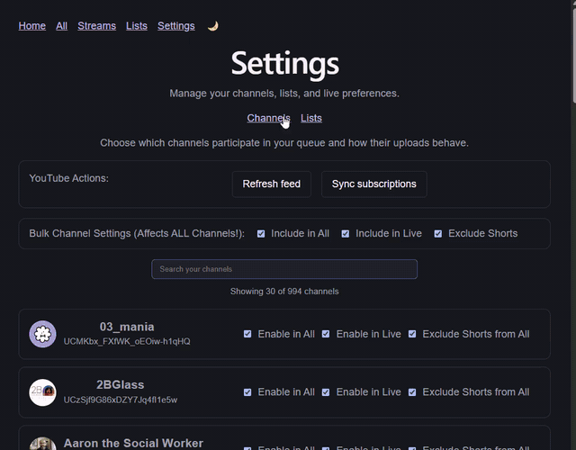

# YT Catchup

A personal YouTube viewing dashboard that lets you watch the most recent uploads from only the channels you're subscribed to. Think of it as a TV queue for your subscriptions.

<p align="center">
  
</p>

## Features

- **All**: the main queue, recent uploads across all your enabled channels, in round-robin order.
- **Lists**: custom lists that scope the queue to a subset of your subscribed channels.
- **Settings**: per-channel preferences (enable/disable in All, enable/disable Live, exclude Shorts), with bulk-edit controls.
- **Catch-up mode**: autoplay straight through your unwatched videos instead of picking each one manually.
- **Changelog**: a page summarizing what shipped, grouped by date.

## Tech stack

### Frontend
- Vite + React SPA
- Custom `Player` component built around the YouTube IFrame API for managing playback, watched state, and autoplay.

### Backend
- Node/Express API for handling Google/YouTube OAuth, storing refresh tokens, and syncing the user's subscriptions into Postgres.

### Database
- Postgres does the heavy lifting: joining cached videos with watched state and filtering per user preferences directly in SQL, leaving the API to handle round-robin ordering and queue shaping.

## Getting started

1. Install dependencies:
   ```bash
   pnpm install
   ```
2. Set up environment files:
   ```bash
   cp .env.example .env
   cp .env.dbmate.example .env.dbmate
   ```
   Fill in `.env` with a Google OAuth client ID/secret (for Google/YouTube login) and generate a value for `TOKEN_ENCRYPTION_KEY`.
3. Start Postgres and apply migrations:
   ```bash
   pnpm db:up
   ```
4. Run the app (client + server together):
   ```bash
   pnpm dev
   ```

## Scripts

| Command | What it does |
|---|---|
| `pnpm dev` | Runs the client (Vite) and server (`tsx watch`) together |
| `pnpm db:up` | Applies pending Postgres migrations via dbmate |
| `pnpm db:status` | Shows migration status |
| `pnpm db:new` | Creates a new migration file |
| `pnpm --filter client build` | Type-checks and builds the client for production |
| `pnpm --filter client lint` | Lints the client |
| `pnpm --filter client test` | Runs client tests (vitest + React Testing Library) |
| `pnpm --filter server test` | Runs server tests (vitest) |
| `pnpm db:status:production` | Shows migration status against the production database |
| `pnpm db:up:production` | Applies pending migrations to the production database |

## TODO / Future additions

- Independent `pg_dump` backup script for the production database, separate from whatever Railway's managed Postgres provides by default
- Rate limiting on `/api/auth/*` endpoints
- Prune channels whose uploads playlist 404s from `channel_recent_cache_state` and `user_subscriptions`, since they currently just fail and retry indefinitely every ttl cycle
- Export/import for Lists, with the option to subscribe to any channels in an imported list you're not already subscribed to
